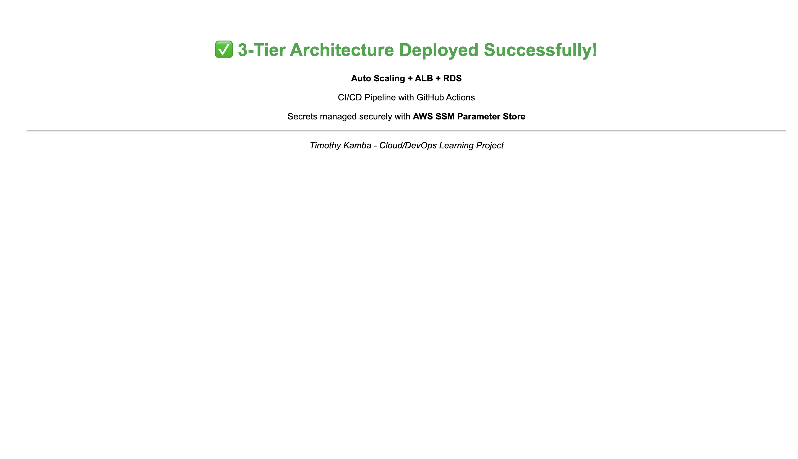

# 🚀 3-Tier Auto-Scaling Web Application on AWS

A complete **production-ready 3-tier architecture** built as a Cloud/DevOps learning project using Terraform and GitHub Actions.



---

## 📐 Architecture Overview

```
┌─────────────────────────────────────────────────────────┐
│                    INTERNET                             │
└────────────────────────┬────────────────────────────────┘
                         │
┌────────────────────────▼────────────────────────────────┐
│      Application Load Balancer (ALB)                    │
│              Public Subnets (AZ1, AZ2)                  │
└────────────────┬──────────────────┬─────────────────────┘
                 │                  │
    ┌────────────▼──┐    ┌──────────▼────────┐
    │  EC2 Instance │    │  EC2 Instance     │
    │  (Private)    │    │  (Private)        │
    └────────┬──────┘    └──────────┬────────┘
             │                      │
             └──────────┬───────────┘
                        │
          ┌─────────────▼─────────────┐
          │   RDS MySQL Database      │
          │   (Private Subnet)        │
          │   Multi-AZ Failover       │
          └───────────────────────────┘

Auto Scaling: 2 - 4 EC2 instances based on demand
```

---

## 🛠️ Technology Stack

| Component | Technology | Purpose |
|-----------|-----------|---------|
| **Infrastructure** | Terraform + HCL | IaC for AWS resources |
| **Compute** | EC2 + Auto Scaling Group | Scalable application servers |
| **Load Balancing** | Application Load Balancer | Distribute traffic across instances |
| **Database** | Amazon RDS MySQL | Persistent data storage |
| **Networking** | VPC + Subnets + NAT Gateway | Secure network isolation |
| **Secrets** | AWS SSM Parameter Store | Secure configuration management |
| **CI/CD** | GitHub Actions | Automated deployment pipeline |
| **Frontend** | Static HTML | Responsive web interface |

---

## 📁 Project Structure

```
aws-ha-autoscaling-project/
│
├── 📄 README.md                 ← Project documentation
├── 📄 STRUCTURE.md              ← Detailed structure guide
├── 📋 .gitignore                ← Git exclusions
│
├── 📦 terraform/                ← Infrastructure as Code
│   ├── main.tf                  ← Root module composition
│   ├── variables.tf             ← Input variables
│   ├── outputs.tf               ← Output values
│   ├── terraform.tfstate        ← State file
│   └── modules/
│       ├── vpc/                 ← VPC, subnets, NAT gateway
│       ├── security-groups/     ← ALB & EC2 security rules
│       ├── alb/                 ← Application Load Balancer
│       ├── ec2/                 ← EC2 instances & launch template
│       └── autoscaling/         ← Auto Scaling Group config
│
├── 🌐 app/                      ← Application Code
│   ├── index.html               ← Static website homepage
│   ├── package.json             ← Project metadata
│   ├── .env.example             ← Environment template
│   └── .gitignore               ← App-specific exclusions
│
├── 🔧 scripts/                  ← Deployment Scripts
│   ├── user-data.sh             ← EC2 initialization
│   ├── deploy-staging.sh        ← Staging deployment
│   └── deploy-production.sh     ← Production deployment
│
└── 🤖 .github/workflows/        ← CI/CD Pipeline
    └── deploy.yml               ← GitHub Actions workflow
```

### 📂 Folder Descriptions

**`terraform/`** - All infrastructure defined as code  
Organizes AWS resources into reusable modules for VPC, security, load balancing, compute, and databases.

**`app/`** - Static HTML website  
Single-page application deployed to EC2 instances. Contains HTML, environment configuration, and build metadata.

**`scripts/`** - Automation and deployment  
Bash scripts for EC2 bootstrap, environment setup, and deployment orchestration across staging/production.

**`.github/workflows/`** - CI/CD automation  
GitHub Actions pipeline that builds, tests, and deploys application with manual approval gates.

---

## 🔄 CI/CD Pipeline

```
Push to Main
    │
    ▼
┌─────────────────┐
│ Build Package   │  (15s)
│ Validate code   │
└────────┬────────┘
         │
         ▼
┌─────────────────┐
│ Test & Validate │  (10s)
│ Security checks │
└────────┬────────┘
         │
         ▼
┌─────────────────┐
│ Deploy Staging  │  (14s)
│ Rolling update  │
└────────┬────────┘
         │
         ▼
┌─────────────────┐
│ Manual Approval │  ⏸️ Awaiting
└────────┬────────┘
         │
         ▼
┌─────────────────┐
│Deploy Production│  (14s)
│ Zero-downtime   │
└────────┬────────┘
         │
         ▼
    ✅ SUCCESS
   Live in AWS
```

**Pipeline Stages:**
1. **Build Package** - Validate and package application
2. **Test & Validate** - Security checks and Terraform validation
3. **Deploy to Staging** - Test deployment with rolling updates
4. **Manual Approval** - Human review before production
5. **Deploy to Production** - Live deployment with zero downtime

---

## ✨ Key Features

| Feature | Description |
|---------|-------------|
| 🔄 **Auto-Scaling** | Scales from 2-4 instances based on CPU load |
| 📊 **Load Balancing** | ALB distributes traffic across healthy instances |
| 🗄️ **Database Failover** | RDS Multi-AZ for automatic failover |
| 🔐 **Security** | VPC isolation, security groups, SSM Parameter Store |
| 🚀 **Zero-Downtime** | Rolling updates with ALB health checks |
| 🤖 **CI/CD Pipeline** | Automated testing and deployment |
| 📍 **Multi-AZ** | Resources spread across availability zones |
| 🔑 **OIDC Auth** | GitHub Actions authenticated via AWS IAM |

---

## 🚀 Quick Start

### Prerequisites
- Terraform >= 1.0
- AWS CLI configured with credentials
- GitHub repository access

### Deployment

```bash
# Clone and initialize
git clone https://github.com/timkamba2002/aws-ha-autoscaling-project.git
cd aws-ha-autoscaling-project/terraform
terraform init

# Review and deploy
terraform plan
terraform apply

# Push to trigger CI/CD
git push origin main
```

---

## 🔧 Configuration

### Scaling Settings
Edit `terraform/modules/autoscaling/main.tf`:
```hcl
min_size          = 2    # Minimum instances
desired_capacity  = 2    # Normal count
max_size          = 4    # Peak load
```

### Security Groups
Modify `terraform/modules/security-groups/main.tf`:
- ALB: HTTP (80), HTTPS (443)
- EC2: Application port from ALB
- RDS: MySQL (3306) from EC2 only

---

## 📊 Troubleshooting

**EC2 instances failing health checks?**
- Verify security group allows ALB traffic
- Check: `curl http://<instance-ip>:3000/health`

**ALB showing unhealthy targets?**
- SSH into instance and check logs
- Verify application is listening on correct port

**Database connection failures?**
- Check RDS security group allows EC2 access
- Verify credentials in AWS SSM Parameter Store

---

## 🎓 Lessons Learned

### ✅ What Worked Well
- Modular Terraform design for easy scaling
- OIDC eliminates AWS key management
- Zero-downtime deployments with ALB health checks
- GitHub Actions provides great CI/CD visibility

### ⚠️ Challenges Overcome
- Health check alignment between ALB and application
- User data script debugging and error handling
- OIDC configuration and IAM permissions
- Terraform state management best practices
- Multi-AZ setup for true high availability

### 🚀 Future Enhancements
- CloudWatch monitoring dashboards
- Auto-scaling based on custom metrics
- SSL/TLS with AWS Certificate Manager
- Route 53 DNS management
- CloudFront CDN distribution
- Automated database backups to S3

---

## 👤 Author

**Timothy Kamba** - Cloud/DevOps Learning Project  
[GitHub](https://github.com/timkamba2002)

---

Made with ❤️ as a hands-on Cloud/DevOps learning project
